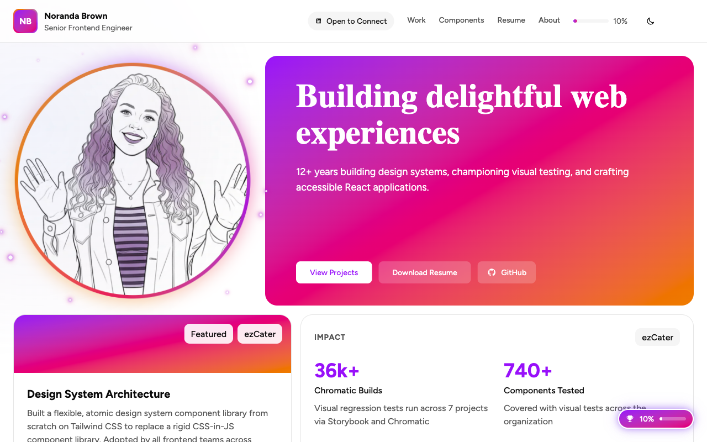
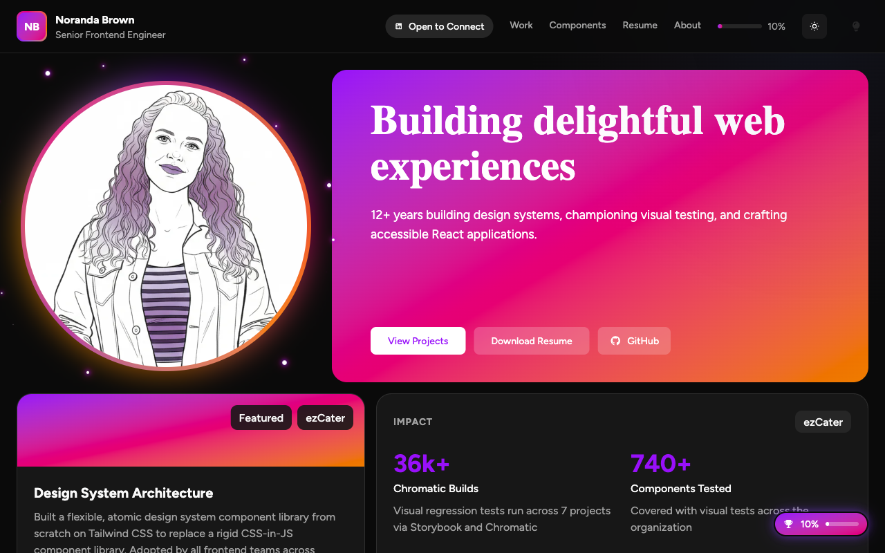

# norandabrown.com

**From mapping volcanoes to mapping components.**


Portfolio of a senior frontend engineer who started her career studying rocks and Venus volcanoes at NASA, then pivoted to building UIs that people actually enjoy using. This site is itself a showcase project - built with React 19, Tailwind CSS v4, and meticulous attention to accessibility, testing, and developer experience.

**[View live site](https://norandabrown.com)** | **[Component Storybook](https://norandabrown.com/storybook)**

---

<p align="center">
  
  &nbsp;
  
</p>

---

## Highlights

- **Gamification system** - Achievements, progress tracking, and a surprise at 100% completion
- **Interactive solar system** - About page with orbiting planets representing life chapters
- **Component playground** - Live Storybook embedded in the site with all UI components
- **Void mode** - A secret third theme for those who find dark mode insufficiently dramatic
- **Animated career timeline** - Scroll-driven animations tracing the geology-to-code pipeline
- **PDF resume generation** - Client-side resume rendering with `@react-pdf/renderer`
- **Console easter eggs** - Open DevTools for a surprise
- **Accessible** - Semantic HTML, skip navigation, focus management, forced-colors support
- **Three themes** - Light, dark, and void (for when dark mode isn't enough)

## Tech Stack

| Category | Technologies |
|----------|-------------|
| Framework | React 19 |
| Language | TypeScript |
| Styling | Tailwind CSS v4, CSS custom properties |
| Build | Vite |
| UI Components | shadcn/ui, Radix UI |
| Icons | FontAwesome |
| Animation | Framer Motion |
| Testing | Vitest, Storybook, Testing Library |
| Deployment | Vercel |

## Getting Started

**Prerequisites:** Node 18+, Yarn

```bash
# Install dependencies
yarn install

# Start dev server
yarn dev

# Start Storybook
yarn storybook

# Run all tests (unit + Storybook interaction)
yarn test

# Build for production
yarn build
```

## Testing

71 tests across two test runners:

- **41 Vitest unit tests** - Component logic, hooks, utilities
- **30 Storybook interaction tests** - Play functions on every story with step-by-step assertions
- **Accessibility** - axe-core a11y checks enforced as hard failures on all stories

```bash
yarn test              # Run everything
yarn test:unit         # Vitest only
yarn test:storybook    # Storybook interaction tests only
yarn test:coverage     # Vitest with coverage report
```

## Project Structure

```text
src/
  components/
    about/          # Solar system, career timeline
    common/         # PageMeta, SEO, shared components
    gamification/   # Achievements, progress, Bug Blaster
    home/           # Hero, highlights
    layout/         # App shell, navigation, footer
    onboarding/     # Command palette onboarding
    playground/     # Storybook embed
    resume/         # PDF resume generation
    ui/             # Button, Select, Toast, Dialog, Tooltip...
    work/           # Case studies, project cards
  context/          # Theme, gamification state
  data/             # Resume, projects, achievements
  hooks/            # Custom hooks
  pages/            # Route-level page components
  stories/          # Storybook stories with play functions
```

## License

[MIT](LICENSE)
